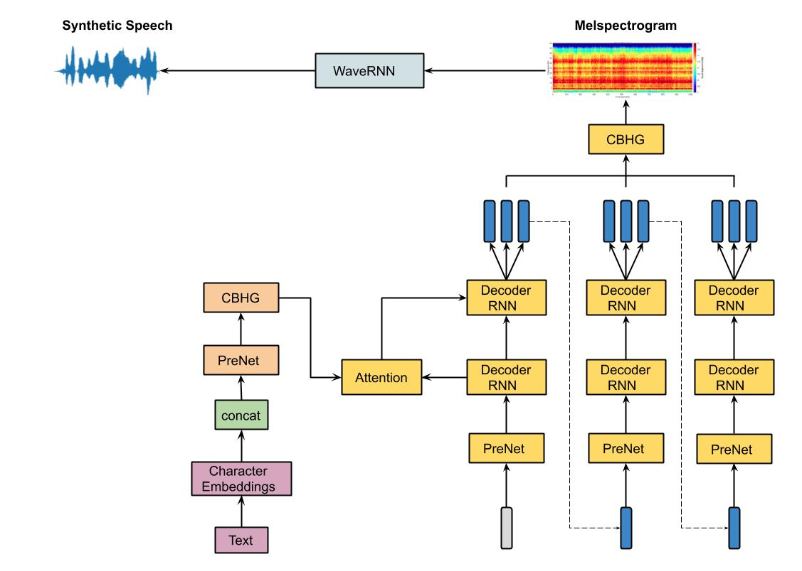
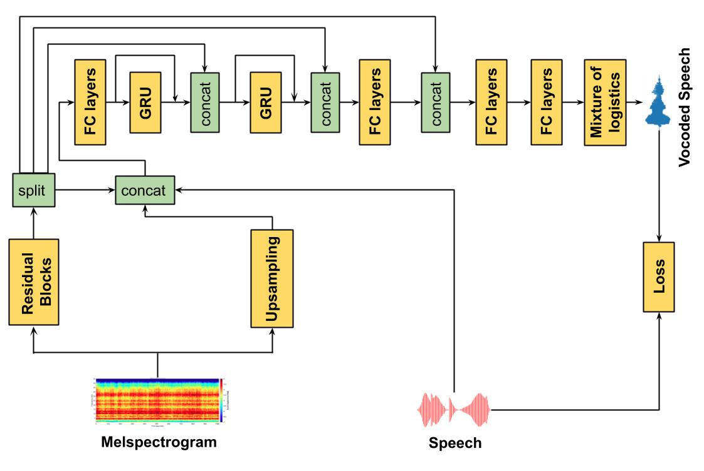

# Tacotron + WaveRNN Diagram:

# WaveRNN Diagram:

Pytorch implementation of Tarotron and WaveRNN model.

# Installation

Ensure you have:

* Python >= 3.6
* [Pytorch 1 with CUDA](https://pytorch.org/)

Then install the rest with pip:

> pip install -r requirements.txt

# Training

Download your Dataset.

Edit **hparams.py**, point **wav_path** to your dataset and run:

> python preprocess.py

or use preprocess.py --path to point directly to the dataset
___

Here's my recommendation on what order to run things:

1 - Train Tacotron with:

> python train_tacotron.py

2 - You can leave that finish training or at any point you can use:

> python train_tacotron.py --force_gta

this will force tactron to create a GTA dataset even if it hasn't finish training.

3 - Train WaveRNN with:

> python train_wavernn.py --gta

NB: You can always just run train_wavernn.py without --gta if you're not interested in TTS.

4 - Generate Sentences with both models using:

> python gen_tacotron.py wavernn

this will generate default sentences. If you want generate custom sentences you can use

> python gen_tacotron.py --input_text "this is whatever you want it to be" wavernn

And finally, you can always use --help on any of those scripts to see what options are available :)

____

### References

* [Efficient Neural Audio Synthesis](https://arxiv.org/abs/1802.08435v1)
* [Tacotron: Towards End-to-End Speech Synthesis](https://arxiv.org/abs/1703.10135)
* [Natural TTS Synthesis by Conditioning WaveNet on Mel Spectrogram Predictions](https://arxiv.org/abs/1712.05884)

### Acknowlegements

* [https://github.com/fatchord/WaveRNN](https://github.com/fatchord/WaveRNN)
* [https://github.com/keithito/tacotron](https://github.com/keithito/tacotron)
* [https://github.com/r9y9/wavenet_vocoder](https://github.com/r9y9/wavenet_vocoder)
* Special thanks to github users [G-Wang](https://github.com/G-Wang), [geneing](https://github.com/geneing) & [erogol](https://github.com/erogol)
